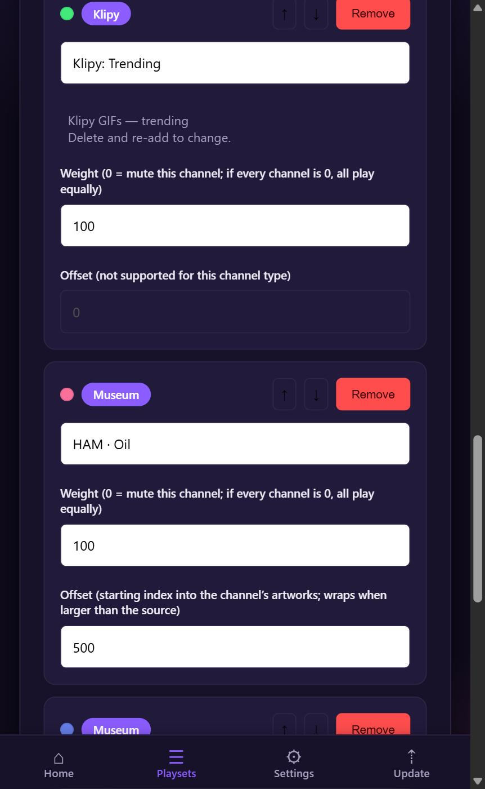
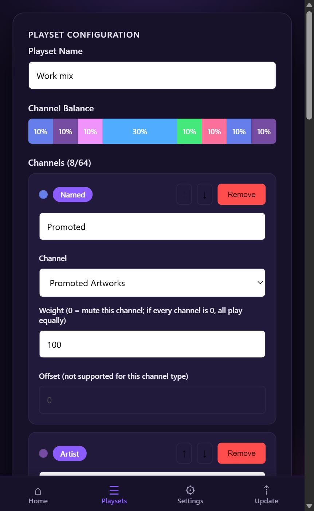
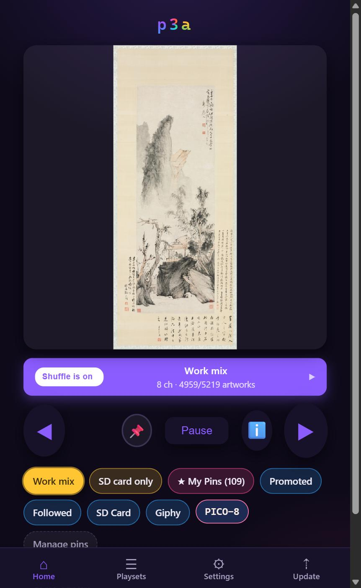
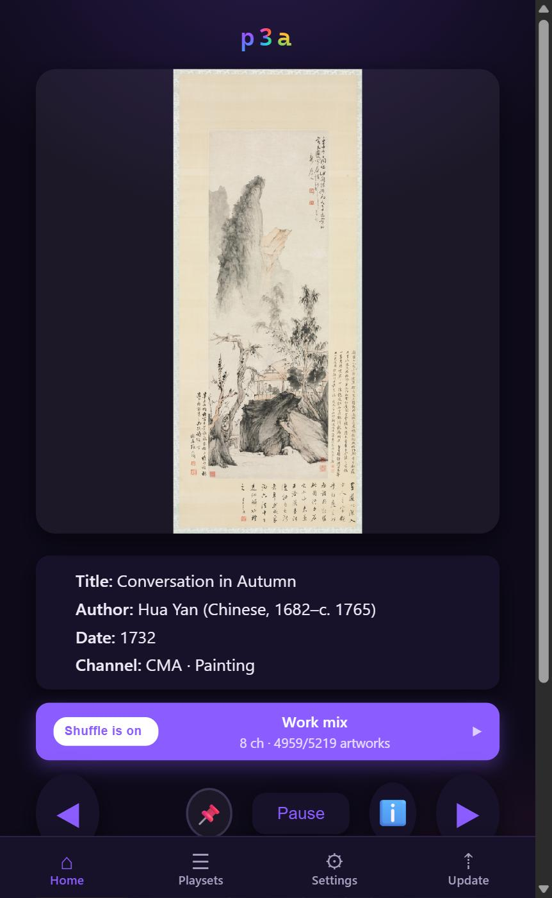
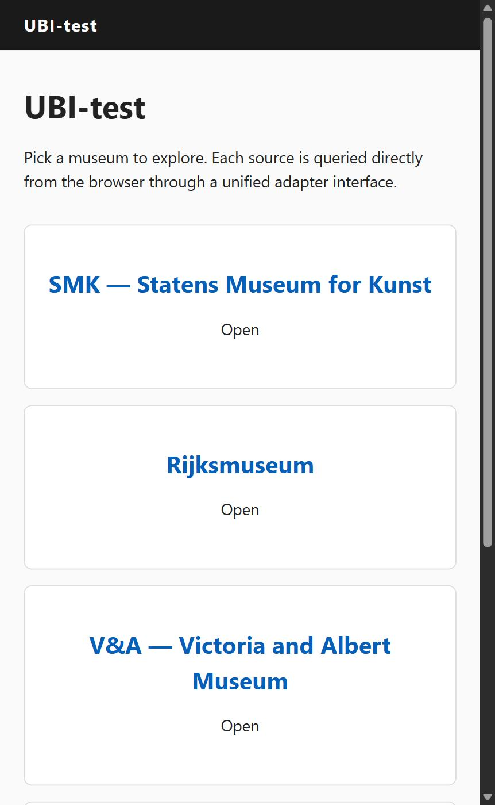
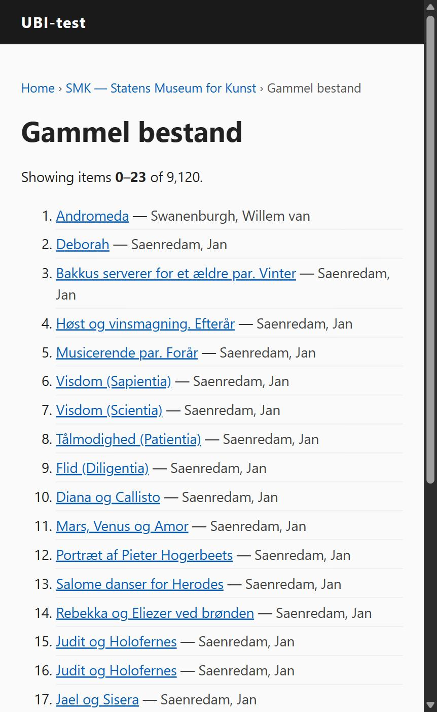
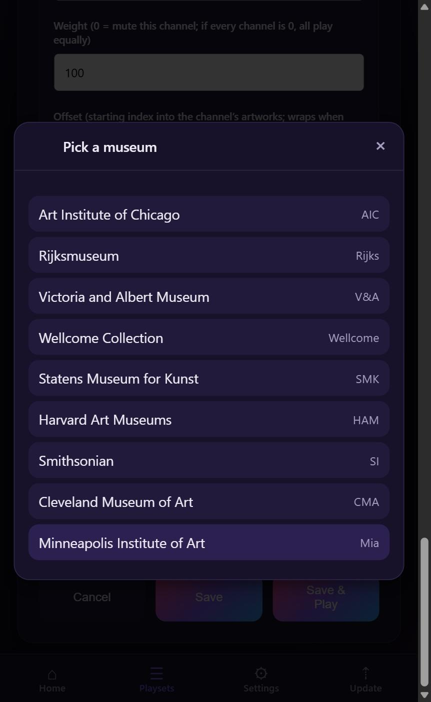
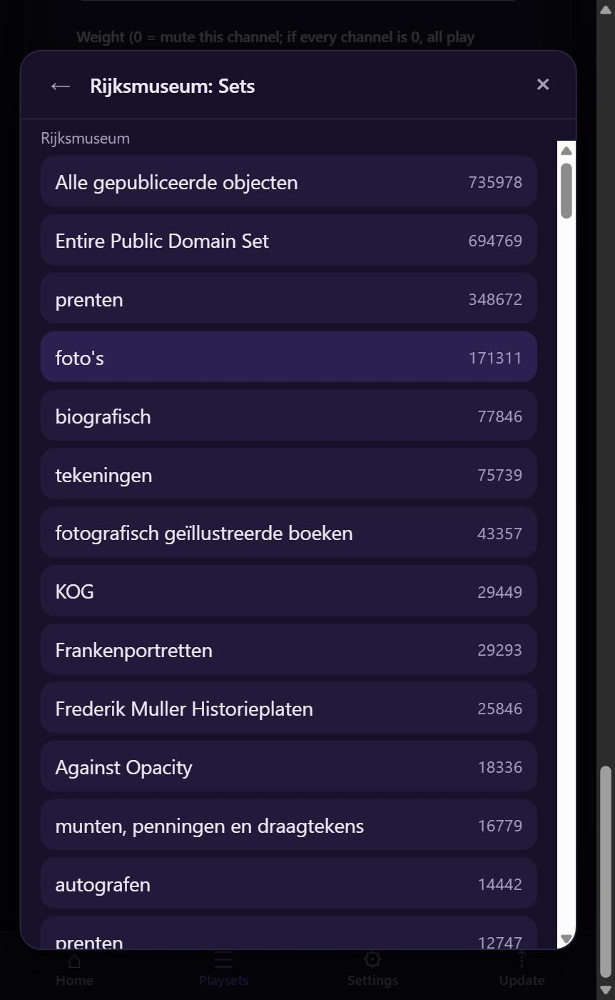
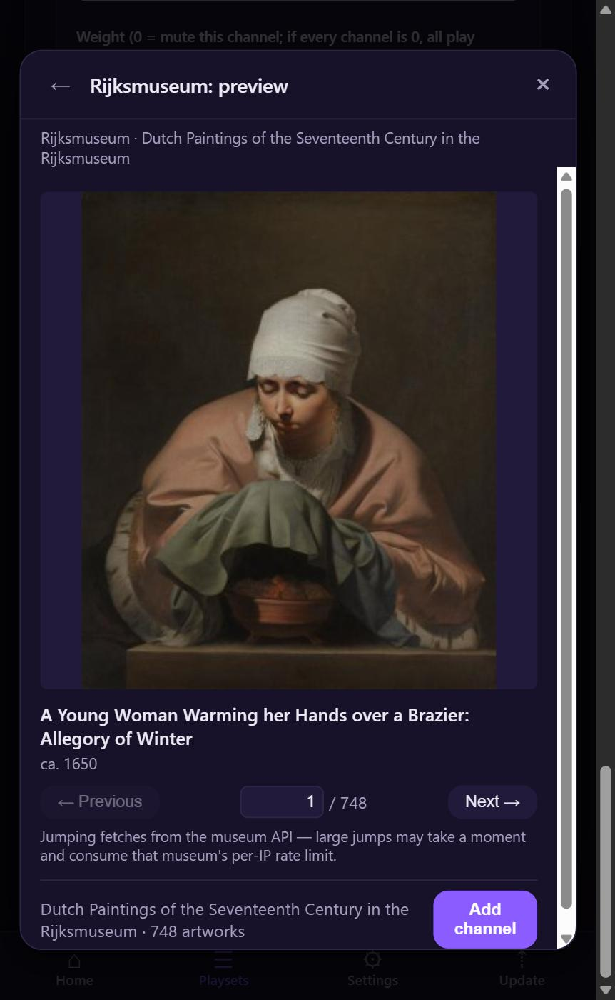

<!-- _class: title -->
<!-- _paginate: false -->


# IIIF from the smallest patron

## What nine museum APIs look like from a 32 MB art frame

**Fabrício Kury**
Biomedical informatician in New York City. Currently works with Medicare claims data analytics at Sparx, Inc.

IIIF Community Call · 14 October 2026 · github.com/fabkury/p3a

<!--
[~1:15]

Thank you, [host name], and thank you to [the Slack member who invited me]. I posted about this project on IIIF-Discuss in August, received a very kind invitation on Slack shortly after, and here I am. I very much value your attention.

My name is Fabrício. By day I'm a Data Engineer in New York City. As a Data Engineer I work with health insurance claims data analytics. None of what I will present today is my job, and furthermore, I hadn't heard of IIIF until May this year. I approach you today with deep modesty.

In this presentation I want to introduce to you this little device I am holding on the photo, and review with you how IIIF looks like from its perspective. This presentation is like a field report from the smallest regular visitor the IIIF image servers probably have.

The photo on the device is Degas's Two Dancers, c. 1893–98. It was fetched from their IIIF endpoint at the Art Institute of Chicago.

[pause]

Me being able to hold a great painting in my hand like that, and everything I'll present, exists because people inside the museums fought for open access and for IIIF. For that, I am thankful, and nothing in this talk should be taken as a complaint.

If asked:
- How you got here: IIIF-Discuss post 2026-08-25 (no replies on the list), Slack invitation in September.
- The image: AIC artwork 45243, CC0, fetched with the exact template on the URL slide.
- Bio in one line: biomedical informatician; Medicare claims analytics at Sparx, Inc.; p3a is unaffiliated hobby work.
-->

---

# What p3a is


- An open-hardware desktop art frame, Apache 2.0
- Sits on a desk or shelf; shows one artwork at a time
- Pixel art, GIFs, your own files, and since May, museums
- No cloud, no account, no subscription
- Every unit was assembled by the person who owns it

<!--
[~1:00]

p3a is an open-hardware desktop art frame, Apache 2.0. It sits next to you and shows one artwork at a time on a good square screen. Then it shows the next one.

It started as a pixel-art player. The photo is the frame playing a piece from Makapix Club, a pixel-art social network I also run, open source and noncommercial. That's the world it came from. Then it learned GIFs, then your own files, and since May, museums.

There's no cloud in the picture. The firmware talks to each source's server directly and decodes the image on the chip. No account, no subscription, no server of mine between the museum and the frame.

And there's nothing to buy from me. Every one of these was assembled by the person who owns it: a forty-dollar board, a screwdriver, fifteen minutes. First, the board.

If asked:
- Makapix Club: open-source pixel-art social network, noncommercial; the one optional account, for sending artworks to a frame from anywhere.
- Units in the field: unknown by design; there is no telemetry.
- Formats: animated WebP, GIF, APNG; static PNG, JPEG, BMP.
-->

---

# The hardware, in one breath


- Waveshare ESP32-P4 board, **$39.99** at the manufacturer
- 4-inch **720 × 720** IPS touchscreen
- Dual-core **400 MHz** microcontroller
- **32 MB** of RAM, 32 MB of flash
- No operating system, no browser stack

<!--
[~1:15]

The hardware, in one breath. A Waveshare board with an ESP32-P4 on it: thirty-nine ninety-nine at the manufacturer, under seventy dollars with a microSD card and a USB-C supply. Less than most exhibition catalogs.

A four-inch, 720 by 720 IPS touchscreen. A dual-core RISC-V microcontroller at 400 megahertz, and I do mean microcontroller. 32 megabytes of RAM, of which about 768 kilobytes is the fast internal kind, and 32 megabytes of flash. Wi-Fi from a second small chip on the same board. No operating system beyond a real-time kernel, no browser stack. The firmware is C.

Hold on to three numbers, because they're the ones the hardware actually fixes: 720 pixels on a side, 32 megabytes of RAM in total, and a TLS stack that doesn't look like a browser's. Almost everything else you'll hear today is a choice I made, and I'll try to say which is which as we go.

Now let me show you the thing running.

If asked:
- Board: Waveshare ESP32-P4-WIFI6-Touch-LCD-4B; Wi-Fi 6 via a companion ESP32-C6 over SDIO; GT911 touch; hardware JPEG decoder.
- Price checked August 2026; re-check the week before.
- "No OS": FreeRTOS only; firmware in C on ESP-IDF 5.5.
-->

---

<!-- _class: dark -->

# Ninety seconds of the device

<video src="../demo.mp4" width="100%" controls muted></video>

<!--
[~1:00]

[play the clip, muted; narrate over it]

[shot 1, wide] This is p3a on a desk. Forty-dollar board, four-inch square panel, no operating system, no browser.

[shot 2, the panel rotating through museums] Everything on that screen came over the IIIF Image API, straight from the museum's own server to the frame. Rijksmuseum. V&A. Wellcome. SMK. Each one sized by the server to exactly 720 pixels.

[shot 3, the info tap] The device stores no metadata. Tap the info button on your phone, and your phone asks the museum: title, artist, date.

[shot 4, the browse modal] Adding a channel looks like this. Channels are the museum's own facets. I'm picking a Rijksmuseum curated set, and the preview is resolving a Linked Art chain live, one artwork at a time.

[shot 5, back on the device] And a minute later, it's on the frame.

[shot 6, the board] It really is a forty-dollar board.

[shot 7, final hold] That's the object. Now, what's inside it.

[stop the clip on time regardless of where it is]

[if the fallback clip from May plays instead: skip the shot 3 and shot 4 lines and say "this is the older clip from May, when there were five museums; the browse flow comes up as stills in a few minutes"]

If asked:
- Clip: silent, static shots, stocked cache, 10 s per artwork for the shoot; shot list in video-shot-list.md.
- Fallback: images/videos/art-institution-channels/p3a-museums-2026-05-19.mp4 (five-museum era).
-->

---

# Five sources of content

| Source | What it plays |
|---|---|
| **Makapix Club** | A pixel-art social network; send an artwork to your frame from anywhere |
| **Giphy, Klipy** | Trending GIFs and stickers, searches, categories |
| **Museums** | Nine museums, seven over the IIIF Image API, two over their own CDNs |
| **Local files** | WebP, GIF, PNG, APNG, JPEG, BMP over USB or Wi-Fi |
| **A URL** | Any image the frame can fetch and decode |

<p class="muted small">Mix them all in one playset. Museums are the newest source, and the reason for this talk.</p>

<!--
[~1:00]

Five kinds of sources, one sentence each.

Makapix Club, the pixel-art network: send an artwork to your frame from anywhere, and control the frame from there. Giphy and Klipy: two GIF providers with public APIs; the frame refreshes trending lists through the day, and they're why the channel machinery existed before any museum did. Museums: nine today, seven over the IIIF Image API, two over their own image CDNs. Local files: WebP, GIF, PNG, animated PNG, JPEG, BMP, over USB or Wi-Fi. And a bare URL: any image the frame can fetch and decode.

You can mix all of them in one playset. Museums are the newest source, and they're why I'm here. But to explain how a museum fits, I first need to explain how the frame is put together.

If asked:
- Pixel art and local files upscale nearest-neighbor; GIFs and museum images upscale bilinearly in hardware.
- It also streams PICO-8 games from a browser-hosted emulator, with audio; mention only for a maker crowd.
- Klipy was added after Tenor's API shut down on 2026-06-30.
-->

---

# How it works

- Firmware in C, on a real-time kernel, no OS
- The device serves its own web app to your phone
- It talks to each source's server directly; so does your browser
- Artwork is cached on a microSD card, cleaned up by age
- It updates itself over the air from GitHub Releases

<!--
[~1:30]

For people who think in servers: there is no server. There are three parties: the device, a phone or laptop on the same Wi-Fi, and the source's API.

The device runs a small HTTP server on your local network and serves its own web app from its own flash. That app is how you configure everything: channels, keys, brightness.

Two things dial out. The device, when it refreshes a listing, downloads an image, or checks for an update. And your browser, when you browse a museum's facets before committing to a channel. Both talk to the museum's API directly, and they share one public IP address. That will matter later.

All bulk storage is a microSD card: listings as small binary caches, images as files in a hash-sharded vault, shared between channels of the same museum, evicted by age when the card fills.

And it updates itself: the firmware polls GitHub Releases, verifies a checksum, installs, and can roll back. Sixteen releases so far. This runs unattended on real people's desks, so I treat the main branch as production.

Nothing here is museum-specific yet. The next two slides are the abstraction the museums had to fit into.

If asked:
- LAN name p3a.local via mDNS; full REST API and a WebSocket; nothing reachable from the internet.
- Vault path: museum/{museum_id}/ under the SD root, hash-sharded, one file per artwork regardless of how many channels list it.
- OTA: p3a.bin plus a .sha256 from the latest GitHub Release; the web UI updates separately.
-->

---

# Channels



- A channel is a **list of artworks too large to fetch at once**
- One source, one kind, one term: "Klipy, trending"; "Harvard, medium, Oil"
- The device keeps up to **4,096** records per channel, 1,024 by default
- Listings refresh on a schedule; images download lazily
- An **offset** lets a channel start deep in a large collection

<!--
[~1:30]

The one abstraction every source has to fit is the channel: a list of artworks assumed to be too large to fetch at once. It's one source, one kind of listing, and one term. For Giphy the kind is "trending" or "search" and the term is the query. For a museum, the kind is a facet axis in the museum's own vocabulary, a department, a classification, a curated set, and the term is one value of it. p3a invents no taxonomy.

[point at the screenshot] This is from my own frame. Top card: Klipy, trending. Bottom card: "HAM, Oil", Harvard Art Museums, medium, oil paint. Notice the offset: 500. That means "start at the five hundred and first oil painting." That one field is why "enumerate with a total, at an arbitrary offset" becomes a hard requirement on museum APIs in the second half.

The device keeps up to 4,096 records per channel, 1,024 by default. Listings refresh on a schedule, every four days for museums; a refresh reconciles: new records added, vanished ones dropped, the rest kept so their cached images survive. Images download lazily: the first artworks appear within seconds, the rest fill in as the frame rotates.

Those ceilings, 64 channels and 4,096 records, are a design decision I'll come back to. First: how channels get mixed.

If asked:
- Refresh interval range 1 to 8 days for museums; cache size 32 to 4,096 per channel.
- Offsets are supported for museum, Giphy, SD-card and pinned channels; they wrap when larger than the source.
- The channel abstraction predates IIIF by months; it was built for Makapix and Giphy.
-->

---

# Playsets



- A playset **mixes channels** at chosen shares of airtime
- Each channel has a weight; 0 mutes it; all 0 means equal
- Pick within a channel: **newest first** or **random**
- Up to **64 channels** in one playset
- One artwork every 30 seconds by default

<!--
[~1:15]

A playset is the thing you actually play: which channels, at what weights, plus a pick mode. The scheduler hands out plays in proportion to weight, with a smooth weighted round robin, so a 30 percent channel gets three of every ten slots without runs. Zero mutes a channel; all zeros means equal.

[point at the bar] That bar is the balance of the eight-channel playset on my desk. The wide block is one channel weighted three times the others.

Inside a channel you pick newest-first, for a social feed, or random from the cached window, for a museum. Thirty seconds per artwork by default. Up to 64 channels, and museum channels sit in the same list as GIF channels and local folders. The frame doesn't care where a record came from once it's a file on the card.

Playsets survive reboots and show up as buttons on the home screen. For the second half, remember: the playset is why a museum channel needs a total, to size its window, and an offset, to start deep.

Here's what living with it looks like.

If asked:
- Scheduler: smooth weighted round robin across channels; reversible PRNG within a channel, so back-navigation is deterministic.
- Pick mode and dwell time are device-wide settings, not per playset.
- Boot restore: the last executed playset is snapshotted on the card and re-executed at power-up.
-->

---

# Everyday use

<div class="shots">
<figure><figcaption>Home: current artwork, playset, controls</figcaption></figure>
<figure><figcaption>Info: fetched live from the museum by the browser</figcaption></figure>
</div>

<!--
[~1:00]

Day to day, this is the whole interface. On the frame: tap the right half for next, the left half for previous. Swipe up to pin an artwork. Two fingers rotate the screen. Long-press for device info. Leave it alone and it advances every thirty seconds.

On the phone: the same controls, the playset switcher, brightness, and the info button. [point at the right screenshot] That's what the info button gives you: "Conversation in Autumn", Hua Yan, 1732, from the channel "CMA, Painting". The device stored none of that. When I tapped the button, my browser asked the Cleveland Museum of Art's API.

I'll keep coming back to that choice: attribution is always one tap away, and it always comes from the museum, never from a copy on the device. It's also what keeps the artwork record at 64 bytes.

So that's using one. Here's getting one.

If asked:
- Pin lists are themselves channels; several named lists live under pinned/ on the card. Swiping up on Makapix artwork also sends a Like.
- The home line "4959 of 5219 artworks" is downloaded versus listed across the playset.
- Rotation persists across reboots and applies to the UI as well as the artwork.
-->

---

# The owner's journey: fifteen minutes


1. The board, a microSD card, a USB-C cable, a screwdriver
2. Flash from the browser; no software to install
3. Join the `p3a-setup` network, enter your Wi-Fi
4. Art appears; no account needed
5. From then on it updates itself

<!--
[~1:15]

Every p3a was assembled by the person who owns it, in about fifteen minutes. You buy the board at retail. You add a microSD card, a USB-C cable, and any phone charger, because the frame draws very little. And a small screwdriver, because the card goes in behind the back plate.

Then you flash it from the browser: a web flasher on GitHub Pages, connect, click, done, nothing to install. On first boot the device raises its own Wi-Fi network with a captive portal; you enter your home Wi-Fi once, and from then on it's p3a.local on your LAN.

Art appears right away, with no account, because the Makapix "Promoted" channel plays out of the box. Museums, Giphy and Klipy are a few taps away; two museums need a free key. And after that first flash, the owner never touches a cable again: the device checks GitHub Releases, downloads, verifies, installs, and rolls back if it has to.

Which tells you something about the kind of project this is.

If asked:
- Card: 4 GB minimum, 16 GB or more recommended; FAT32; the device can format it on request.
- The captive-portal network is p3a-setup; the dashboard is http://p3a.local/.
- Alternative flashing methods for people without a WebSerial browser: docs/flash-p3a.md.
-->

---

# Context

- Open source since November 2025; Apache 2.0
- Sixteen firmware releases; the current one is 1.2.3
- Written up by *Make:* magazine; a small Discord
- One person, one board, and a lot of language-model help
- No company, no sponsor, nothing for sale

<!--
[~0:45]

Let me place the project honestly. Open source since November 2025, Apache 2.0, about fourteen hundred commits, sixteen firmware releases; the current one shipped last month. Make: magazine wrote it up. There's a small Discord.

It's one person, one board, and a lot of help from language models; I'll say exactly how much in a few minutes, because it's part of how I found you. No company, no sponsor, nothing for sale, no affiliation with any museum. A hobby-scale project that behaves like a product because it runs unattended on other people's desks.

Now: how a pixel-art player ended up on an IIIF community call. Four steps.

If asked:
- First commit 2025-11-06; firmware 1.2.3 released 2026-09-16; web UI versioned separately (2.23).
- Make: article: makezine.com/projects/desktop-pixel-art-player-p3a.
- No affiliation with Anthropic or Waveshare either; the board is bought at retail.
-->

---

<p class="beat">The road to museums · 1 of 4</p>

# A pixel-art player, first


- November 2025: Makapix Club, then Giphy, then local files
- Channels, playsets, caching, eviction: all built for GIFs
- By April 2026 the frame was finished, and hungry
- Two GIF providers is not a lot of internet

<!--
[~1:00]

Step one. For its first six months the frame had never heard of a museum. It played Makapix Club first, because that's my community. Then Giphy, because trending GIFs make a frame feel alive. Then your own files. Klipy came later, after the GIF-API market collapsed onto those two providers this year.

Everything the museum feature would need was built for pixel art and GIFs: the channel abstraction, the playset scheduler, the SD-card vault, eviction, the web app. By April the frame was finished. And it was hungry. A device that cycles artwork all day is only as interesting as its sources, and two GIF APIs plus one pixel-art community is not a lot of internet.

So I asked a question, and I asked it of a language model: what else could a device like this pull from, directly, with no server of mine in between?

If asked:
- Tenor's API was terminated 2026-06-30; Gfycat died in 2023; Imgur stopped issuing keys; Reddit walled its JSON endpoints in May 2026.
- The channel, playset and vault design is documented under docs/infrastructure/ and predates any museum code.
-->

---

<p class="beat">The road to museums · 2 of 4</p>

# Asking a model to scout the internet

- Early May 2026: "find content sources this device can pull from directly"
- What came back: no live pixel-art feed; NASA's picture of the day; and a museum
- The Art Institute of Chicago's API, and something called the **IIIF Image API**
- I had never heard of it

<p class="muted small">Disclosure: p3a is built end to end with LLM assistance. Every claim in this talk was verified by me against live endpoints.</p>

<!--
[~1:30]

Step two, and the disclosure, said straight, once. p3a is built end to end with language-model assistance: first a variety of models inside the Cursor IDE, mostly Anthropic's, later Claude Code. The design documents in the repository are literally question-and-answer transcripts between me and the model. I direct, I review, I test on hardware, and I take responsibility for every claim in this talk; each one is verified against live endpoints. No affiliation with any of those companies.

In early May I sent agents out with a brief: survey free public APIs a microcontroller can call directly; rank by catalog size, freshness, and effort. Three things came back. The pixel-art sites have no usable live JSON feed. NASA's Astronomy Picture of the Day is a clean daily feed. And the Art Institute of Chicago publishes a search API whose records carry an image identifier that plugs into a URL template from something called the IIIF Image API.

I had never heard of it. This talk exists because a language model introduced me to a library standard.

The first plan, written on May 5th, was two hand-coded sources, Chicago and NASA. NASA never shipped. Chicago became the first museum. And reading Chicago's documentation, it was obvious the image half wasn't Chicago's at all. If one museum spoke IIIF, how many did? That question became a separate project.

If asked:
- How much did the model write: most of the code, under direction; design as Q&A transcripts in docs/; every technical claim verified on hardware or against live endpoints by you.
- The May 5 spec proposed one component per source, modeled on the Giphy component; off-device Python validators pulled 100 AIC images before any C was written.
- Pixel-art sites checked: Pixilart, Pixeljoint, Lospec, OpenGameArt.
-->

---

<p class="beat">The road to museums · 3 of 4</p>

# The UBI, built separately to prove the sources

<div class="shots">
<figure><figcaption>One adapter per museum, queried from the browser</figcaption></figure>
<figure><figcaption>"Artworks 0–23 of 9,120": range pagination as a requirement</figcaption></figure>
</div>

<!--
[~2:00]

Step three. Before committing firmware work, I built a throwaway project on the laptop: the UBI, for unified browsing interface. Its question: can heterogeneous museum APIs be normalized behind one interface at all?

Its charter was written before I looked at a single museum. Collapse categories, sections, folders, sets, departments into one concept: collections. Then three features every source must support: list collections; list artworks 200 to 249 of collection X, a range, not a next-cursor; and keyword search. The hard problem, the charter says, is reconciling heterogeneous capabilities behind one interface, not building any single integration.

Two hard constraints, and remember the second one. The source must expose artworks via the IIIF Image API. And IIIF Presentation was, quote, "strongly preferred, the natural carrier" for collections. Hold that sentence. It comes back.

On May 7th the survey came in: eighteen candidates in a capability matrix. Then a Python probe script per museum that exercised the API and wrote a report with a feature-support table. And a small browser app, one JavaScript adapter per museum, with Playwright tests.

[point at the screenshots] That's the app, served from the repository this week. Left: pick a museum; each source is queried directly from the browser through one adapter interface. Right: SMK's "Gammel bestand", items 0 to 23 of 9,120, with the offset and the row count right there in the URL. That URL is the range-pagination requirement made visible.

Why separately? Because a browser is the cheapest place to learn an API. Every quirk I found there cost nothing on the device. Then it was time for the device.

If asked:
- Tier one of the matrix: SMK, Rijksmuseum, V&A, Chicago, Harvard, Wellcome, Gallica, Library of Congress; tier two: Getty, Smithsonian, Yale, Princeton, NGA, Internet Archive, Europeana, Bodleian, Fitzwilliam, e-codices.
- The UBI app: hash-routed single page, five JS adapters plus a base, Playwright specs per museum; reference/museum-art/ubi-test.
- The "IIIF Image API required" constraint was retired in August when Cleveland shipped over a CDN.
-->

---

<p class="beat">The road to museums · 4 of 4</p>

# From the UBI to firmware

- **10–11 May:** design as five rounds of Q&A; a firmware component in a day
- **11 May:** Chicago, Rijksmuseum, V&A end to end; UBI imported as reference
- **15 May:** first release with five museums
- **22 May:** seven; **24 August:** nine, two of them without IIIF
- JS adapters became the browse UI; C adapters were written from the reports

<!--
[~1:30]

Step four. The UBI became the technical reference: its reports said what each museum could do natively, its adapters said how, and its probe outputs were the test fixtures.

On May 10th and 11th I wrote the p3a design as five rounds of Q&A with the model, then built the firmware component in one day, in six stages, from the skeleton to the web UI. Chicago, the Rijksmuseum and the V&A were live end to end that evening, and the UBI was imported into the repository as reference.

May 12th, Wellcome and SMK. May 15th, the first release, with five museums. May 22nd, Harvard and the Smithsonian, both with free keys: seven. And in August, Cleveland and Minneapolis, over fixed-rendition CDNs, without IIIF at all, at which point the "IIIF required" rule was retired.

What carried over: the UBI's JavaScript adapters became the frame's browse UI, about three thousand lines today. The C adapters were written fresh from the reports. Keyword search is still deferred; channels are facet-based.

Four days from never having heard of IIIF to three museums live. Fifteen days to seven. Here's what that looks like as a product.

If asked:
- The six stages: component skeleton, scheduler wiring, Chicago adapter plus IIIF download path, eviction, REST endpoints for rate-limit sharing, web UI; six commits on 2026-05-11.
- Gallica deferred May 12 (SRU returns XML); Library of Congress scaffolded May 13, removed May 15 (identifier length).
- Browse UI: webui/museum/*.js, about 3,060 lines across nine adapters plus the modal.
-->

---

<!-- _class: dense -->

# Museum channels: nine museums, the museum's own facets

| Museum | Facets you can pick | Key |
|---|---|---|
| Art Institute of Chicago | Departments, classifications, subjects, themes, galleries, artwork types | none |
| Rijksmuseum | Curated sets (193) | none |
| Victoria and Albert Museum | Collections, categories, venues | none |
| Wellcome Collection | Work types, genres, subjects, contributors | none |
| Statens Museum for Kunst | Collections | none |
| Harvard Art Museums | Classifications, centuries, cultures, periods, places, media, techniques, work types, groups, galleries | free key |
| Smithsonian | Cooper Hewitt, SAAM, NPG, NMAAHC, Hirshhorn, African Art | free key |
| Cleveland Museum of Art | Departments, types (CC0 only) | none |
| Minneapolis Institute of Art | Classifications, departments, countries, styles (public domain only) | none |

<!--
[~1:15]

The museum feature from the user's side. A museum channel is a triple: a museum, one of its facet axes, one term. "Rijksmuseum, curated set, Dutch Paintings of the Seventeenth Century." "V&A, category, Photographs."

I won't read the table. Two things to notice. The facets are the museum's own vocabulary; I invent nothing. The Rijksmuseum has one axis, its 193 curated sets; Harvard has ten. And the key column: seven of the nine need no key. Harvard emails you a free one; the Smithsonian uses a free api.data.gov key, and the shared demo key cannot survive one refresh.

Chicago is on the list but currently disabled; I'll say why near the end. The one-sentence version: since August its image host challenges non-browser clients, and cached art still plays.

Defaults: the listing refreshes every four days, 1,024 artworks per channel, thirty seconds per artwork. And no metadata on the device: title, artist and date come from the browser, on demand, from the museum's own API, which is different for every museum. IIIF standardizes none of it.

Here's the flow of adding one.

If asked:
- Smithsonian units shipped: Cooper Hewitt, SAAM, NPG, NMAAHC, Hirshhorn, African Art; NMAI and Freer/Sackler excluded (later slide).
- Cleveland is CC0 works only; Minneapolis public-domain only; Harvard uses the permission-level filter; AIC public-domain images.
- Wellcome terms with labels over 32 characters are hidden from the picker (33-byte channel id slot).
-->

---

# Adding a museum channel

<div class="shots">
<figure><figcaption>1. Pick a museum</figcaption></figure>
<figure><figcaption>2. Pick a facet and a term, with counts</figcaption></figure>
<figure><figcaption>3. Preview one artwork at a time, then add</figcaption></figure>
</div>

<!--
[~1:15]

Stills from my frame on September 17th; it's the flow the clip showed. Step one, pick a museum. Step two, pick a facet and a term; for the Rijksmuseum that's its curated sets, with live counts from the museum's API. The largest set said 735,978 objects that day. On August 7th the same query said 735,001. Collections move, which is why listings refresh.

Step three, the preview. "A Young Woman Warming her Hands over a Brazier: Allegory of Winter", around 1650, artwork one of 748 in that set. Previous and Next step through it; type a number and it jumps. Read the small print: jumps "consume that museum's per-IP rate limit". The browse UI is a guest of the same quota the device uses. And the Rijksmuseum preview takes a moment, because it's resolving a Linked Art chain live to find the image. Second-half story.

"Add channel" commits the channel, not the artwork on screen; the device refreshes the listing and the images fill in as the frame rotates.

Notice who did what: the browser browsed, the device played. That split is worth its own slide.

If asked:
- The preview loads the museum's own rendition at about 400 px; the device later fetches the 720 rendition.
- Channel naming on the device: "{museum}:{axis}" plus the term id; display name like "V&A · Photographs".
- Rijksmuseum is axis-less in the picker: sets are the only axis.
-->

---

# Browser browses, device plays


- The **browser** enumerates facets, previews, and picks
- The **device** persists, refreshes, downloads, plays, evicts
- Both talk to the museum directly; both share one public IP
- One cooldown table, shared between them

<!--
[~1:15]

The split is a product decision that turns into a politeness mechanism. Browsing is interactive, so it runs in your browser. Playing is unattended and periodic, so it runs on the device. Neither goes through a server of mine.

[point at the figure] To the museum, browser and device are one household with one IP address, and museum rate limits are per IP. So when the browse UI gets a 429, it reports it to the device with a small REST call, and the device's cooldown for that museum engages as if its own traffic had tripped it. Before an expensive browse operation, the UI checks the device's cooldown table and waits its turn. That's the dashed box.

One CORS story, because it's my favorite. The Rijksmuseum publishes its list of curated sets over OAI-PMH without CORS headers, so a browser can't fetch it. So the firmware bakes the 193-set list into its flash and serves it to its own browse UI. The device carries a copy of the Rijksmuseum's table of contents wherever it goes, because of CORS headers.

That's the product. Now the other half: what IIIF looks like from inside it.

If asked:
- The JS adapters mirror the C adapters one to one: same museum id, axis names, term ids.
- The report endpoint is POST /api/museum/rate-limits/report-429; unknown museum ids are ignored so it does not leak the museum list.
- Cleveland's vocabulary is baked the same way: no facet endpoint, so a full-corpus scan at release time.
-->

---

<!-- _class: dark -->

# What IIIF looks like from here

## Two layers, seen from a client with three questions

- **Pixels:** one URL template, seven museums
- **Discovery:** nine museums, nine adapters
- Can I list your collections? Can I enumerate one, with a count, at an offset? Is the image id inline?

<!--
[~1:15]

Everything from here is the second half. No thesis to defend: observations, each with a number attached, and at the end a short list of what helped.

From inside the frame, IIIF has two layers. The layer that delivers pixels, which IIIF standardized: one URL template, seven museums. And the layer that finds artworks, which it did not, at least not for a client shaped like this one: nine museums, nine adapters.

The client's whole interface to a museum is three questions. Can I list your collections? Can I enumerate one, with a count, at an offset? Is the image identifier inline?

One word of vocabulary, because "discovery" means three things here. Not the Change Discovery API, the harvesting feed. Not how a person finds a IIIF resource on the web. I mean query in place: "artworks with images in collection X, how many, give me 400 to 499." That's the sense.

Let me spell out the three questions.

If asked:
- The three questions were fixed by the channel design before IIIF entered the picture: the UBI's three features minus keyword search, plus the inline-id requirement the record format forced.
-->

---

# What the client needs from discovery

1. List collections, in the museum's own vocabulary
2. Enumerate one, **with a total, at an arbitrary offset**
3. An image identifier **inline** in every record

And nothing else: the device stores no metadata.

<!--
[~1:15]

Three primitives, for every museum, and they come from the product, not from IIIF.

One: list collections, in whatever vocabulary the museum uses. That becomes the facet picker.

Two: enumerate a collection with a total count, at an arbitrary offset. "Artworks 400 to 499 of Paintings", not merely "next page". The total sizes the cache window; the offset is that channel setting, "Harvard, Oil, offset 500". A device that caches 1,024 of 735,978 artworks needs both numbers.

Three: an image identifier inline in every record, so no further per-artwork request. This is the single biggest determinant of what a client like mine costs a museum, and it's the one the record format forced: 48 of the 64 bytes in a record are that key.

And nothing else. The device stores no metadata. That's a choice, not a hardware limit, and it turns out to be analytically useful: "can a small client browse this museum?" reduces to three yes-or-no questions, which makes comparing museums, and comparing APIs to standards, unusually crisp.

Now the layer that worked.

If asked:
- Keyword search, the UBI's third feature, is deferred; nothing in the primitives requires it.
- A channel with an offset deeper than the total wraps around.
-->

---

# One URL template

```
{iiif_base}/{identifier}/full/!720,720/0/default.jpg
```

- Image API 2 syntax, best fit inside 720 × 720, JPEG
- Worked unmodified on **seven** independently operated image stacks
- One line of C per museum turns an identifier into pixels

<!--
[~1:30]

This is the standards success story, and I'll say it plainly, because the people who wrote and implemented the Image API should hear it.

Once an adapter has produced an image identifier, museums stop being different from one another. The firmware builds this one URL, base, identifier, full region, best fit inside 720 by 720, no rotation, JPEG, and streams the response to the SD card. That is the entire institution-independent contract.

It worked, unmodified, on seven independently operated image stacks: Chicago's in-house server; the Rijksmuseum's images, served by Micrio, a commercial deep-zoom vendor; the V&A's framemark host; Wellcome's own service; Copenhagen's IIPImage; Harvard's URN resolver, which 303s to the real image host; and the Smithsonian's IDS. Seven operators, one line.

And "one line per museum" is literal: the template is a single formatted string inside each adapter's URL builder. Cleveland and Minneapolis fill the same slot with their own CDN pattern.

One more thing this line did: it never cropped. Across about ninety reported-versus-delivered comparisons in August, the delivered aspect ratio equaled the master's at every IIIF museum. Non-square works get letterboxed. The device never crops art.

Let me take the line apart, because not everything in it is the hardware talking.

If asked:
- Do not say "59 shared lines": that file is a User-Agent builder and a percent-encoder, nothing IIIF. The URL builders run 13 to 25 lines each with plumbing.
- Harvard's resolver: nrs.harvard.edu, 303 to ids.lib.harvard.edu; the client follows up to five redirects.
- The survey of about 90 comparisons is dated 2026-08-25.
-->

---

# What the template asks for, and why

- `!720,720` <span class="tag hw">panel</span> best fit inside the screen; a **Level 2** size request in 2.1 and 3.0
- No `^` upscaling <span class="tag choice">choice</span> small works stay small
- No `square` region <span class="tag choice">choice</span> never crop art
- `default.jpg` <span class="tag choice">choice</span> JPEG decodes in hardware; WebP would not
- Image API 2 path <span class="tag choice">choice</span> every server accepted it; several advertise only 2

<!--
[~1:30]

The first place I separate what the hardware fixes from what I chose. The panel decides one number: 720. Everything else on that line is a decision.

The bang size, "!720,720", best fit inside the screen: a Level 2 feature in both Image API 2.1 and 3.0. All seven museums run Level 1 or 2 dynamic servers, so it never failed. A Level 0 static server wouldn't serve it; next slide.

No upscaling. Version 3's caret prefix asks the server to upscale; I never want it. Small works arrive at native size and the device fits them to the panel without inventing pixels.

No "square" region. A museum would happily serve me a square crop, and a photo frame might love that. p3a letterboxes instead, on principle.

JPEG. The chip has a hardware JPEG decoder; WebP would be software-only, and museum servers serve JPEG far more reliably anyway. That's a choice with a hardware reason, not a hardware limit: the frame decodes WebP for pixel art all day.

And the version 2 path. Every server accepted it, several advertise only version 2, and the URL is identical in 2 and 3 for what I request.

Which brings me to the biggest thing the client doesn't do.

If asked:
- The hardware decoder cannot decode progressive JPEGs; Chicago and Harvard serve progressive at this rendition, so those decode in software via libjpeg-turbo, fenced so a corrupt file cannot crash the device.
- "!w,h" is Level 2 in 2.1 and in 3.0; "max" is Level 0 in 3.0.
- Non-square works are letterboxed with a configurable background color.
-->

---

# Skipping `info.json`: a Level 2 bet

- A capable client negotiates: fetch `info.json`, learn sizes, choose
- p3a never does; it asks every server for `!720,720`
- Halves the request count; not one misfire since May
- Where advertisement and reality diverged, they diverged the other way
- **A bet, won so far.** Fallback planned: read `info.json` once per host on a 400 or 404

<!--
[~1:45]

A capable IIIF client reads the menu before ordering: it fetches info.json, learns the sizes, features, formats, and chooses. p3a never does. It asks every server for "!720,720", full stop.

The justification: the panel is 720 by 720, the request has been honored at all seven museums, and skipping negotiation halves the request count on a device that pays a round trip and a quota unit for every request. Since May 15th: zero misfires. And in the one case where advertisement and reality diverged, they diverged the other way; that story comes under SMK.

Now the concession, before someone makes it for me. A Level 0 static server, the cheapest way to publish IIIF, pre-generated sizes on a plain web server or S3, serves only "max" and the sizes it lists. My template 404s there. None of the seven runs one, so the bet never lost. But the smallest patron ought to work with the smallest servers.

So: a bet, won so far, and the fix is cheap and planned. Try the template; on a 400 or 404, fetch info.json once per host, pick the largest listed size that fits 720, remember it. One extra request per host, once. There's a politeness argument too: a listed size is a pre-rendered derivative; an arbitrary size may be assembled from tiles on the fly.

And I'll admit the standing problem: a client that never reads the advertisement has no business complaining that it lies. The fallback is what gives me standing.

Next: the number that shaped the whole client.

If asked:
- If the fallback ships before the call, say "fixed since <date>" instead of "planned".
- On a 2.1 server without a sizes list, "full/full" returns the master; the 16 MiB download cap guards that.
- Why not WebP even where advertised: SMK advertises it and returns 400; the hardware decoder is JPEG-only anyway.
-->

---

# The 64-byte record, a design decision

<div class="cols">
<div>

<span class="num">64 B</span><span class="numlabel">per artwork; 48 of them for the museum's image identifier</span>
<span class="num">16 MB</span><span class="numlabel">64 channels × 4,096 records, in RAM at once: half the device</span>

</div>
<div>

<span class="num">33 B</span><span class="numlabel">per channel identifier, in the playset format</span>
<span class="num">0</span><span class="numlabel">bytes of title, artist, or date on the device</span>

</div>
</div>

<p class="muted">Chosen so that tens of multi-thousand-artwork channels can be loaded together. Everything implicit becomes a byte.</p>

<!--
[~1:45]

Earlier versions of this talk framed this slide wrong, so let me get it right. The artwork record is 64 bytes, and the hardware did not impose that. It's a budget I set so that 64 channels of 4,096 records fit in memory at the same time: 64 times 4,096 times 64 bytes is 16 megabytes, half the device, with the other half left for decoding and display. Fewer channels or smaller caches would have bought longer identifiers. I chose breadth: tens of multi-thousand-artwork channels, loaded together.

Inside the 64 bytes: a hash, dimensions, a timestamp, a file type, two failure counters, and 48 bytes for the museum's image identifier. Longer identifiers are unusable, and that's what excluded the Library of Congress; I'll come to it.

So from this client's side, identifier length is an interoperability property. Chicago's image UUIDs are 36 characters, Harvard's URNs about 25, Micrio's ids about 8, Cleveland's accession numbers up to 14. All fit. And identifier stability is one too: an identifier that drifts reads to me as a deletion plus a brand-new artwork, re-downloaded under the new id.

The other two numbers: 33 bytes for a channel identifier in the playset format, which is why Wellcome terms with labels over 32 characters can't become channels, since Wellcome filters by label, not id. And zero bytes of title, artist or date. Three choices in one family. Everything implicit becomes a byte.

Let me put the whole ledger on one slide.

If asked:
- The file-type byte doubles as the Rijksmuseum resolver's state machine: 0xFF not yet resolved, 0xFE given up.
- The record layout is compile-time asserted at 64 bytes; the Rijksmuseum key stores both the Micrio id and the object id after resolution.
- A deferred design lifts the 32-character Wellcome label limit: docs/deferred/wellcome-long-labels.md.
-->

---

# What the hardware fixes, and what p3a chose

<div class="cols">
<div>

**Fixed by the board** <span class="tag hw">hardware</span>

- 720 × 720 pixels
- 32 MB RAM, 768 KB of it fast
- A hardware JPEG decoder, with limits
- A TLS stack that is not a browser's
- No browser, no XML parser in the SDK
- Hence two TLS sessions, bounded parse buffers, streamed downloads

</div>
<div>

**Chosen by the project** <span class="tag choice">choice</span>

- The 64-byte record and 48-byte id
- No `info.json`, no upscaling, no crop
- JPEG only, for museums
- No metadata on the device
- No middleman, no harvester
- The three discovery primitives

</div>
</div>

<!--
[~1:45]

This slide keeps the rest of the talk honest.

[left column] What the board is. 720 by 720. 32 megabytes of RAM, 768 kilobytes of it fast. A hardware JPEG decoder with limits. A TLS stack that is not a browser's, which is what bot defenses see. No browser, no XML parser in the SDK. And the last line follows from the RAM: each TLS context costs tens of kilobytes of the fast memory, so two concurrent sessions device-wide; JSON is parsed inside a fixed buffer sized per museum, 192 kilobytes for Chicago up to a megabyte for the Smithsonian; and images stream to the card in small chunks, with a cap in case a server sends the master. A client with 32 megabytes of RAM does not get to just download the image and see.

[right column] What I decided, given the left. The 64-byte record. No info.json, no upscaling, no crop. JPEG only, for museums. No metadata on the device. No middleman, no harvester. The three primitives. Every one of those could be revisited at a price: longer ids by trading channel count, negotiation by one request per host, WebP by software decoding, metadata by a bigger record, a harvested index by adding a server.

Why this matters for you: when I say "p3a could not use X", please don't hear "small devices cannot use X". Usually it means "this project's priorities didn't include X, at that price."

One more thing a small client owes you before the museums one by one: manners.

If asked:
- Parse buffers: Chicago and Rijksmuseum 192 KB; V&A, Wellcome, Cleveland 256 KB; SMK and Minneapolis 512 KB; Smithsonian 1 MB; all in PSRAM, because a 1 MB JSON of small nodes would fragment the DMA pool the Wi-Fi path needs.
- Download: 32 KB chunks through a fixed buffer, temp file, rename on completion, 16 MiB cap, 15 s timeout, three attempts.
- Progressive JPEGs fall back to software decoding; the fence replaces libjpeg's exit() with setjmp/longjmp and yields every 200 ms for the watchdog.
-->

---

# Being a polite client


- Identify yourself, with an email
- Honor `Retry-After`; remember it; share it
- One rate-limit budget per household
- Pace even when allowed

<!--
[~1:30]

A device that lives in living rooms and refreshes museum APIs on a timer had better be a good citizen, so several mechanisms exist purely for politeness.

Identify yourself. Every request carries a User-Agent of "p3a", the version, and my email address. Chicago asks for this explicitly with a custom header; the Smithsonian enforces the spirit of it with a firewall, and I'll tell that story.

Honor Retry-After, remember it, share it. Each museum has one cooldown slot on the device. Any 429 engages it: Retry-After when present, capped at an hour; sixty seconds otherwise, sized to Chicago's sixty-per-minute window. Every layer that dials out checks it. Cooldowns only extend, never shorten.

One budget per household: the browser-device split from earlier. One IP, one cooldown table.

And pace even when allowed: 150 to 200 milliseconds between page fetches; browse probes capped at six at a time; two TLS connections device-wide. A full channel refresh is roughly 41 to 82 API calls against daily quotas of a thousand to twenty-five hundred where quotas exist, every four days.

Two honest gaps: a designed "three connection failures in thirty seconds" trigger was never implemented, and the firmware reuses no HTTP connections today; handle reuse is planned, and it will cut handshakes, not request counts.

Now, what the nine adapters actually cost.

If asked:
- The User-Agent string: p3a/{version} (pub@kury.dev); AIC additionally asks for an AIC-User-Agent header.
- Cooldowns are RAM-only, lock-free reads, absolute timestamps; they do not survive a reboot.
- Quotas: Harvard 2,500 per day per key; Smithsonian 1,000 per hour per key; Chicago 60 per minute per IP.
-->

---

# Nine museums, nine discovery layers

<div class="cols">
<div>

<span class="num">1</span><span class="numlabel">line of C per museum turns an identifier into pixels</span>

</div>
<div>

<span class="num">3,740</span><span class="numlabel">lines of C, across seven IIIF museums, to find the identifier</span>

</div>
</div>

- Same three primitives, seven search APIs; plus 966 lines for two museums without IIIF
- Chicago: the best documented, still the longest

<!--
[~1:30]

Two numbers. One line of C per museum turns an identifier into pixels. Three thousand seven hundred and forty lines of C, across the seven IIIF museums, find the identifier.

Per adapter, as of this month: Chicago 849, Rijksmuseum 645, Smithsonian 526, Harvard 477, Wellcome 438, SMK 406, V&A 399. Minneapolis and Cleveland, the two CDN museums, add 966 more; they're evidence that without IIIF I also had to write rendition logic, not evidence about IIIF. The core around all of them is another thousand lines and isn't IIIF either.

It's a crude proxy, and I'll concede it: some of every adapter is the fixed cost of having an adapter at all, and I haven't measured that split. The variance is the rest.

None of these museums is doing anything wrong. Each API is internally coherent and most are genuinely good. The point is the variance: nine reasonable APIs are still nine APIs, and the client pays for each difference in code, in buffer sizes, and in failure modes that each have to be learned once, the hard way. Chicago has the best documentation I found and still the longest adapter; that story comes near the end.

The Rijksmuseum is the exception worth a whole slide, because its discovery layer is the one that is itself standards-based.

If asked:
- Line counts are wc -l on components/art_institution/museums/*.c as of September 2026; the core is 994 lines.
- The browser-side adapters are another 3,060 lines of JavaScript.
-->

---

# Rijksmuseum: Linked Art, three hops down

- The one discovery layer of the nine that is itself standards-based
- HumanMadeObject → VisualItem → DigitalObject → image URL
- Each hop a JSON-LD fetch; nothing inline
- Resolved lazily, one artwork per download pass; three failures tombstone
- It works, in production, at a price

<!--
[~1:45]

I want to say this with respect: the Rijksmuseum did the standards-based thing, and it works. Its discovery layer is Linked Art, served as an ActivityStreams stream of pages: a hundred records per page, an opaque page token, a total in the stream. It isn't IIIF; it's Linked Art. But it's the standards path in the wider sense, and I'd rather say so than have someone say it for me.

The price is that nothing in the listing carries an image identifier. For every artwork the client walks HumanMadeObject, to VisualItem, to DigitalObject, to an access point whose URL finally names the Micrio image id. Each hop is a separate JSON-LD fetch: 13.5 kilobytes, then 1.5, then 0.6.

Three hops per artwork at listing time would be brutal, so the adapter resolves lazily: the refresh stores unresolved records, and the download loop resolves one artwork per pass, between image downloads. A fresh channel takes about fifty minutes to fully populate; the first artworks appear within seconds. A record that fails three times is tombstoned until a future refresh re-lists it. One rule learned the hard way: an unresolved record must never overwrite a resolved one, or it orphans the file already on disk.

Cursor-only pagination also means my arbitrary-offset primitive is emulated: read the total, wrap the offset, pay the throwaway page fetches. Every cost here is the honest price of the standards-based path.

And it made me wonder whether the other standards path, IIIF Presentation, could have been the discovery layer. So I went and looked.

If asked:
- Listing endpoint: data.rijksmuseum.nl/search/collection with memberOfSetId and imageAvailable=true; 100 per page; partOf.totalItems (735,978 for the largest set on 2026-09-17).
- The walk: HumanMadeObject, shows[], VisualItem, digitally_shown_by[], DigitalObject, access_point[].
- Firmware wrinkle: id.rijksmuseum.nl 303s to data.rijksmuseum.nl and the HTTP client would not surface the Location header; captured in an on-header event handler.
- The Micrio manifest exists (P3, 1.6 KB) but its label is an opaque hash.
-->

---

<!-- _class: dense -->

# Could Presentation have been the discovery layer? What I found

Live probes, 7 and 9 August 2026, re-run 11 September. Harvard with a valid key.

| Museum | Collection document | Per-artwork manifest |
|---|---|---|
| Chicago | No; `/iiif/2/collection` resolves as an image named "collection" | Yes, P2, 2.5 KB |
| Rijksmuseum | No; Linked Art + ActivityStreams instead | Yes, P3, 1.6 KB, label is a hash |
| V&A | No; root 404 | Yes, P2, 2.9 KB |
| Wellcome | **Yes**, P3 tree; both facet children **503**, on every date | Yes, P3, 107 KB |
| SMK | None advertised | Yes, P3, 3.4 KB, from the search host |
| Harvard | **Root exists**; its one child returns **500**, on every date | Yes, P2, 9.2 KB |
| Smithsonian | Not in the documentation | Undocumented |

Two of seven publish a Collection; both broke where enumeration begins. Manifests presuppose discovery.

<!--
[~2:00]

Remember the UBI charter: Presentation was "strongly preferred, the natural carrier". The system I shipped uses none of it. That decision was made in the fog of development, so in August I went back and probed all seven IIIF museums, twice, Harvard with and without a valid key, and again on September 11th, with the same result. Three observations came out: adoption, this slide; then the specification; then the economics.

Chicago: the image server treats "collection" as an image identifier and redirects to an info.json that 404s. Nothing is mounted there. Manifests exist, but hang off the search API's id space.

The Rijksmuseum: no Collection; discovery is Linked Art.

The V&A: clean per-object manifests, no collection surface at all.

Wellcome: the strongest adopter of the seven. A handsome top-level tree that even materializes facet axes as sub-collections. Both facet children I probed returned 503 on every date, each describing itself as "temporarily unavailable". If anyone from Wellcome is on the call, I would love to be told this was an outage.

SMK: manifests from the search host, keyed by object number; no collection advertised.

Harvard: ships the advertised root, and the single child that would enumerate objects returns 500, with and without a key, on every date. Dead one level down, exactly where discovery would begin. Same offer to Harvard.

So: six of seven serve lovely per-artwork manifests, but a manifest is addressed by an id only the search API can supply. Manifests presuppose discovery rather than provide it. Two of seven publish a Collection, and both have been broken at the enumeration level since August, which suggests, as an observation and not a verdict, that nothing in production depends on them.

And that agrees with what the specification itself says.

If asked:
- Re-probe the week before the call and update the dates; commands in material.md, section 6.3.
- Neither Wellcome's nor Harvard's root items carry a thumbnail.
- Presentation editors who may be listening: Tom Crane (Wellcome's stack) and Robert Sanderson (Linked Art). If Crane says Wellcome's catalogue API is the discovery layer by design, that is your observation stated as their architecture; welcome it.
-->

---

# What Collections are for

- Presentation 3.0: "provision of metadata for harvesting and discovery is not directly supported"
- Its change log: paging "was neither implemented nor especially different from a hierarchy", so it was removed; Collections became **navigation, not discovery**
- 2.1 had `first`, `next`, `total`, `startIndex`; `total` optional, navigation link-following
- Content Search: text within one object
- Change Discovery: a feed for harvesters; metadata search "out of scope"

<!--
[~2:15]

I'll quote rather than paraphrase, because this room wrote the text.

Presentation 3.0, Objectives and Scope: "Provision of metadata for harvesting and discovery is not directly supported."

The 3.0 change log: "Collection paging was neither implemented nor especially different from simply having a hierarchy of Collections", so "paging functionality was removed from the API". The log adds that Collections became "exclusively for navigation and not discovery". The editors said it first. I'm reporting that it's true from the outside.

So in 3.0, Collections are ordered trees of references: no paging, no item counts, no offset access, no facets, no metadata search. "Artworks with images in department X, total, offset 400" is not expressible.

Presentation 2.1 did have paging: first, next, total, startIndex. But total is optional and navigation is link-following only. Even the friendliest reading is sequential traversal with an optional count: the Rijksmuseum cursor walk, with all its costs. And nobody among the nine serves a paged 2.1 Collection.

Content Search searches annotation text within a single object; descriptive metadata is out of scope. "Find this word in this book", not "find artworks by department".

Change Discovery is an ActivityStreams feed for harvesters who "start at the end and walk backwards", built for "global or thematic search engines", and it lists "the recommendation or creation of metadata search APIs or protocols" as out of scope. The one spec that could have held a query surface declares it out of scope, in writing.

Presentation kept its scope. The gap is above it. There's a feed for harvesters and a search for text inside one object, and no query surface for "artworks in collection X, how many, give me 400 to 499". Every museum already runs that index. Its bespoke search API is that index.

Let me put numbers on the difference.

If asked:
- Never say "Presentation failed"; say "Presentation kept its scope; the gap is above it."
- The paging removal is Presentation 3.0 change log entry 1.4.4 and GitHub issue #1343, which called it a simplification "at no cost".
- Change Discovery 1.0 (2021) and Content State 1.0 (2022) are the Discovery group's published outputs; neither is a query surface. Ask whether anything since has been chartered.
-->

---

# Bytes and requests

- One bespoke search page: 50–100 artworks with image ids, **14–185 KB**
- One manifest: **1.6 KB** (Micrio) to **107 KB** (Wellcome)
- A 1,024-artwork channel: **10–20 requests** on the bespoke path
- The Presentation path: a tree walk plus about **1,000 manifest fetches**, since no observed Collection carried thumbnails
- **50–100×** the requests, and each request is a round trip and a quota unit

<!--
[~2:00]

Measured on August 7th, the same day as the probes.

One bespoke search page with image identifiers inline: Chicago, 14 kilobytes for a hundred artworks, about 142 bytes each. The Rijksmuseum, 8 kilobytes for a hundred ids, plus the three hops later. V&A, 101 kilobytes for a hundred. Wellcome, 110. SMK, 185 kilobytes for fifty. On a laptop that verbosity is invisible; on this device it's the difference between a 192-kilobyte parse buffer and a 512-kilobyte one.

One manifest: 1.6 kilobytes at Micrio, 2.5 at Chicago, 2.9 at the V&A, 3.4 at SMK, 9.2 at Harvard, and 107 kilobytes at Wellcome. A single Wellcome manifest weighs as much as a whole hundred-work catalogue page.

Now one channel of 1,024 artworks. The bespoke path: ten to twenty requests, 140 kilobytes at Chicago, about two megabytes at SMK. The Presentation path: a tree walk plus about a thousand manifest fetches, since no Collection I observed carried thumbnails; 2.5 megabytes at Chicago sizes, over 100 megabytes at Wellcome sizes. Fifty to a hundred times the requests.

And let me be precise about what a request costs, because my first draft said "a TLS handshake", and that was my client's fault, not the protocol's: the firmware opens a new connection per request today, and reusing them is planned. So: a round trip and a quota unit. Reuse shrinks handshakes, not request counts, and request counts are what quotas meter: on Harvard's 2,500-a-day key, a thousand manifests is 40 percent of a day for one channel. And at the end of the walk, still no counts and no offsets.

That qualifier about thumbnails was deliberate, because there is a case where Presentation gets close.

If asked:
- Rijksmuseum's 78 bytes per artwork exclude the three JSON-LD hops, about 15.6 KB per artwork at download time.
- Under Chicago's 60 per minute, a thousand manifests is 17 minutes of wall clock; radio round trips run 100 to 300 ms.
- If handle reuse ships before the call, say "fixed since <date>"; the multiplier is a request count and does not change.
-->

---

# Where Presentation gets close: thumbnails

- 3.0: Collection items "should have" a `thumbnail`; an Image service on it is recommended
- The service id **is** the image identifier: primitive three, inline
- A 1,024-artwork channel as sub-Collections: about 11 fetches, half a megabyte
- Still no total, no offset, no paging: primitive two stays open
- Neither observed Collection carried thumbnails. **Does anyone publish one this way?**

<!--
[~2:00]

Let me make the counter-argument before someone else does, because it's a fair one.

Presentation 3 says items in a Collection "should have" a thumbnail, and recommends an Image API service on it. So for this one document type, the standard already prescribes the thing I'll ask for at the end: an image identifier, inline. The service id in that thumbnail is my identifier; my template on it is legal on any Level 2 server. Primitive three, satisfied.

The estimate, labeled as such: an item with a thumbnail and a service is about 500 bytes, so a hundred-item sub-Collection is about 50 kilobytes, and a 1,024-artwork channel is about eleven fetches and half a megabyte. That's inside the range of the bespoke pages. With thumbnails, the multiplier drops from "a thousand manifests" to "walk the tree".

What stays open is primitive two: no totals, no offsets, and no paging in 3.0, so a facet of 735,978 works is one document or a tree I walk end to end. A museum that published hierarchy-paged Collections with thumbnails and image services on every item would satisfy two of my three primitives, and I would write that adapter tomorrow.

In the field it didn't happen: neither Wellcome's nor Harvard's root carries thumbnails, and the children that would list artworks are down. My guess at why: Collections are hand-curated navigation. "Hierarchy instead of paging" assumes small sets.

So that's a real question for this room, and I'll ask it again at the end: does anyone publish a facet-sized Collection with thumbnails and image services on every item?

And there's a second counter-argument I owe you.

If asked:
- Presentation 3.0 text: items "must have the id, type and label properties. They should have the thumbnail property"; "It is recommended that a IIIF Image API service be available for images"; the cookbook's simple Collection recipe says the same.
- The 500-byte-per-item figure is an estimate, not a measurement.
- Half a megabyte per 1,024 is byte-competitive with the V&A's or Wellcome's own search pages.
-->

---

# Harvest elsewhere?

- Change Discovery plus an index on the SD card is a legitimate design
- The device already bakes 193 Rijksmuseum set names and Cleveland's vocabulary
- None of the seven documents a Change Discovery feed for artworks
- A snapshot is stale the day it ships; keeping it fresh is harvesting again, somewhere
- It would move the truth from the museum's live facet to my copy of it

<!--
[~2:00]

The second counter-argument: you already harvest at build time, so why not run Change Discovery on a laptop, ship a compact index on the SD card, and query that? No cloud middleman.

Nothing breaks technically, and the principle isn't absolute: the device trusts GitHub Releases for its firmware, and it carries the Rijksmuseum's 193 set names and Cleveland's vocabulary. A per-museum index on the card is a legitimate design. Three things stopped me.

Adoption: none of the seven IIIF museums documents a Change Discovery feed for artworks; I say "documents" because I can't prove absence. The Rijksmuseum and the Getty publish ActivityStreams over Linked Art records, not IIIF manifests, so at six of seven there's nothing standard to harvest.

Size and freshness: the Rijksmuseum alone is 735,978 image-bearing objects, about 35 megabytes of identifiers. That fits a card, not the flash. And a snapshot is stale the day it ships; the feed is built for incremental updates, but applying them is harvesting again, on a schedule, somewhere. That somewhere is the middleman. It would be me, and every device would depend on it.

And truth: today a channel is the museum's own facet, live, with the museum's own counts. With a baked index it becomes my snapshot of the museum.

If anyone wanted a harvested-index design, the right owner is an aggregator, and a thin query surface is exactly what an aggregator could expose. Europeana is that aggregator, and it fails me at pixels: thumbnails capped at 400. The museums kept the pixels and have no shared discovery. The two halves of my requirement live in different institutions.

I'll leave that as an observation and get back to the museums, one line each.

If asked:
- Change Discovery 1.0: audience "other IIIF-aware systems"; consumers "should start at the end and walk backwards"; totalItems optional; metadata search APIs out of scope.
- Arithmetic: 735,978 records at 48 bytes is about 35 MB; the device's own ceiling of 64 channels of 4,096 is 16 MB.
- The feed claim is "none documents one", checked against their docs only.
-->

---

<!-- _class: dense -->

# Idiosyncrasies, one line each

<div class="cols">
<div>

- **Chicago:** `from + size` capped at 1,000, undocumented
- **Rijksmuseum:** three JSON-LD hops to reach an image id
- **V&A:** venue counts read 0 with the has-images filter
- **Wellcome:** filters by the label string; no stable id
- **SMK:** `info.json` promises WebP; server says 400

</div>
<div>

- **Harvard:** half of "has image" has no image, without a permission gate
- **Smithsonian:** WAF rejects with **HTTP 200**
- **Cleveland:** no IIIF; fixed 750–1,300 px renditions
- **Minneapolis:** no IIIF; S3 buckets; `[]` past 10,000

</div>
</div>

<!--
[~1:30]

I won't read the list. I'll say this about it: every one of these was learned the hard way, and none is documented as a failure. And every museum on it made the open-access decision that makes the frame possible, so affection first.

Two rows for flavor. The V&A's venue facet returns a count of zero when combined with the has-images filter, so the browse UI enumerates venues unfiltered and re-probes each term with the filter, in the browser, once per session. And Harvard: without the permission-level filter, 57 of the first hundred "has image" records have no usable image URL, because about a quarter of that set is permission-restricted at a layer the flag doesn't see. The fix is one query parameter, once you know it exists.

The rest are variations on a theme: a cap that isn't documented, a filter that works by label instead of id, an endpoint that silently ignores a filter, a field that's sometimes an object and sometimes an array, a bare empty array past ten thousand. None is a bug in the museum's terms. Each is a place where a reasonable API and a reasonable client didn't know about each other.

Three deserve a full minute, and two of those deserve it together.

If asked:
- Chicago: 403 past about page ten on large facets; asks for a custom AIC-User-Agent header.
- Wellcome: its /images endpoint silently ignores the /works filters; labels over 32 characters cannot become channels.
- SMK: trimming fields returns empty items, so 50 records cost about 205 KB.
- Harvard: about 22% of periods and 27% of galleries have terms longer than 32 characters and are dropped.
- Smithsonian: usage:CC0 is not indexed for filtering; media is sometimes an object, sometimes an array.
- Cleveland: width and height are strings, occasionally empty; no facet endpoint, vocabularies baked at release.
- Minneapolis: raw Elasticsearch in the URL path; mojibake with unpaired surrogates in the Style facet.
-->

---

# Two more, in one minute each

<div class="cols">
<div>

**Smithsonian: the WAF that says 200**

- Default User-Agent rejected
- With HTTP 200 and an HTML page
- Symptom: JSON parse error on success
- Fix: identify yourself. One line

</div>
<div>

**SMK: the `info.json` that lies**

- Friendliest API of the nine
- `info.json` advertises WebP
- Server returns 400 for it
- Negotiation would have hurt

</div>
</div>

<!--
[~2:15]

First, the Smithsonian, and a firewall that says yes when it means no.

Its search API and image service sit behind a web application firewall that rejects requests with an empty or default User-Agent. Fine. It rejects them with HTTP 200 and an HTML page reading "Request Rejected". So for a firmware client, the failure signature is a JSON parse error on what claimed to be a successful response. Every signal along the way insisted the request had worked. It's among the most misleading failure modes in the whole project. The fix costs one line: a User-Agent that says who I am, with an email address, which is exactly what a firewall wants from a well-behaved bot. The lesson is simple in hindsight. The diagnosis was not. The Smithsonian also has the largest records of the nine, fifty can exceed half a megabyte, so that adapter alone budgets a one-megabyte buffer. This is the evidence for "reject loudly" on my closing list.

[right column] Second, SMK, and let me start by saying SMK has the friendliest API of the nine: true offset pagination, anonymous, clean JSON, image dimensions right in the listing. It's the API I'd point a newcomer at. And it has one perfect irony. Its image server's info.json advertises WebP, and the server returns 400 when you ask for it. So the one museum where capability negotiation would have changed p3a's behavior is the one where negotiation lies. That's why skipping info.json has been safe so far: divergence went the other way. An info.json is a promise, and small clients are the ones that believe it. If anyone from SMK is on the call: it's one line in one file, and I'll send you the request. Still my favorite API.

And then there's Chicago, which I promised to explain.

If asked:
- Smithsonian: api.si.edu and ids.si.edu behind F5 BIG-IP; the shared DEMO_KEY (about 30 requests per hour per IP) cannot survive one refresh; a free api.data.gov key gives 1,000 per hour against about 82 calls per refresh.
- SMK: IIPImage server at iip.smk.dk; asking the search API to trim fields returns empty items, so pages are swallowed whole, about 4 KB per record, 512 KB of buffer for fifty.
- SMK's image id is the JP2 filename after /iiif/jp2/; some records carry only a UUID thumbnail and are skipped.
-->

---

# Chicago: the thousand-record wall

- Anonymous search: `from + size` must stay at or under 1,000
- The search accepts Elasticsearch-style bodies, and honors range filters on the artwork id
- So the adapter **partitions the museum**: count with `size: 0`, bisect the id space until every bucket holds ≤ 1,000, then page inside buckets
- Up to 64 buckets, recomputed at every refresh, because the collection moves
- I am fond of this code, and slightly discontent that it needs to exist

<!--
[~1:45]

Chicago has the best-documented API I found, and one undocumented wall. For anonymous callers, "from" plus "size" on the search endpoint has to stay at or under a thousand, and paging past about page ten on a large facet returns a 403. You learn this by hitting it.

The requirement on my side is mine, not Chicago's: arbitrary offsets, so a channel can start at record 5,000 of Prints and Drawings. A standard with cursors and totals would have replaced what comes next with a sequential walk, the Rijksmuseum's cost, not zero.

Here's what comes next. Chicago's search accepts Elasticsearch-style JSON bodies by POST, and it honors range filters on the numeric artwork id. So for offsets beyond a thousand, the adapter partitions the museum: it probes counts with size zero, recursively bisects the id space until every bucket holds at most a thousand records, up to 64 buckets, then pages inside the buckets. A forty-dollar device performing adaptive query planning against a museum's search engine, recomputed at every refresh, because the collection moves.

I am fond of this code, and slightly discontent that it needs to exist. It's what happens when a design choice meets an undocumented limit. Both are reasonable. The code between them is the cost of the two not knowing about each other, which is "document the sharp edges", item seven on my closing list, in a single adapter.

And Chicago is also where the newest problem showed up first.

If asked:
- The id space bisected runs to about one million; buckets are capped at 64.
- Sort has to travel inside the POST body; the GET sort parameter returns 400.
- The IIIF host also returned sporadic 403s (about 1% of fetches) in May, handled as skip-and-retry rather than as a dead image.
-->

---

# Bot defense is now a compatibility issue

- Since 14 August, Chicago's image host answers non-browser clients with a challenge
- The metadata API is fine; the image host refuses the device's TLS fingerprint
- The firmware ships with AIC marked unavailable; cached art keeps playing
- Finna, Science Museum Group, Brooklyn: excluded on the same grounds in August
- Honest identification should stay a sufficient answer

<!--
[~1:45]

One factual sentence per bullet, and no blame; Chicago was the first museum I integrated and has the best documentation I found.

Since August 14th, Chicago's IIIF image host answers non-browser clients with a Cloudflare managed challenge, a 403; the metadata API is unaffected. A desktop client fetched ten sampled renditions without a challenge. The block is client-fingerprint based, and the device is the fingerprint that gets refused.

That fingerprint is in the hardware column from earlier. An mbedTLS handshake from an ESP32 looks like exactly what these systems flag, and the device can't pretend to be Chrome. What it can do is identify itself honestly, which it does, with an email address in every request.

So the firmware ships with Chicago marked unavailable through a per-museum flag: refreshes and downloads are skipped, cached art keeps playing, and the web UI shows a badge. The adapter is one flag away from coming back, and I'll re-test the week before this call. [if it unblocked on the re-test, say so here]

Chicago isn't alone: in an August survey of about sixty sources, Finna, the Science Museum Group and the Brooklyn Museum were excluded on the same grounds. Any source I commit to now gets a real-hardware TLS probe before design work.

A legitimate small client is collateral here unless "identify yourself honestly" remains a sufficient answer. If anyone on the call runs IIIF behind a WAF, I'd like to ask you afterwards what a non-browser client should send.

Two more things I noticed from where I sit.

If asked:
- The block is on www.artic.edu/iiif/2 with a same-origin resource policy, so even cross-origin image loads from the browse UI fail; api.artic.edu is unaffected.
- The same host had a Cloudflare challenge episode in December 2025 during a denial-of-service attack; resolved then (data-aggregator issue 151).
- "Unavailable" is a dispatch-table flag per museum; clearing it is a one-line change.
-->

---

# Two more things I noticed from here

<div class="cols">
<div>

**Museum APIs are mortal**

- NYPL's Digital Collections API retired 1 August
- Walters, MKG Hamburg: gone quietly
- p3a carries a per-source kill switch

</div>
<div>

**Fixed-bucket renditions are spreading**

- Wikimedia now rejects non-bucket widths
- Cleveland and Minneapolis are bucket-only
- They fit this panel by luck; IIIF's size parameter turns luck into a guarantee

</div>
</div>

<!--
[~1:15]

Two ecosystem observations, and both raise the value of what IIIF got right.

Museum APIs are mortal. NYPL's Digital Collections API retired on August 1st, days before my survey. The Walters closed its API in 2023. MKG Hamburg's host no longer resolves. Any client that embeds institutions has to plan for their absence; that per-source kill switch is what Chicago is using today.

[right column] And fixed-bucket renditions are spreading. Wikimedia's thumbnails now exist only at bucket widths: ask for 720 and you get a 400. Cleveland serves fixed renditions of 750 to 1,300 pixels; Minneapolis serves 400, 800 and full. Those two work on this panel only because their baked sizes happen to land near 720. IIIF's size parameter is what makes a 720-pixel panel not depend on luck. Call it quiet advocacy from the consumer side.

Both trends make the Image API's uniformity more valuable, not less. It's precisely what makes a nine-museum client maintainable by one person and their language models.

Now, the ones I couldn't ship.

If asked:
- Minneapolis's old image hosts were dead; its images turned out to live at 1.api.artsmia.org with 400, 800 and full pre-renders; the 800 bucket is about 50 KB, the lightest delivery of any museum.
- Wikimedia's 960 bucket works; 720 returns HTTP 400.
- The content-sources survey of 2026-08-02 assessed about 60 sources; docs/content-sources-survey.md.
-->

---

# The ones that could not ship

- **Library of Congress:** IIIF ids up to 123 characters; my 48-byte slot <span class="tag choice">choice</span>
- **Gallica:** SRU returns XML; no XML parser on the device <span class="tag hw">sdk</span> <span class="tag choice">choice</span>
- **Getty:** enumeration only, 4.5 M entities, no search; the harvester model <span class="tag choice">choice</span>
- **Europeana, DPLA:** thumbnails, 400 px at most, on a 720 px panel <span class="tag hw">panel</span>
- **Smithsonian NMAI, Freer/Sackler:** ARK ids unresolved; zero records

<!--
[~2:00]

These are constraints of the device meeting properties of an API, never verdicts on an institution, and each one is tagged with the column it comes from.

The Library of Congress. Excellent IIIF service; my template verified; anonymous fetches work with a polite User-Agent. But identifier length is bimodal: 27 to 47 characters in Prints and Photographs, maps and manuscripts; 67 to 123 in newspapers and music. Whether an item fits my 48-byte slot depends on which storage subtree it lives in, not on any facet a user could pick. Scaffolded on May 13th, removed on May 15th. The clearest case of identifier length as an interoperability property, and the slot is my choice: a wider slot, at the price of fewer channels, would let LoC in.

Gallica: the catalogue search is SRU, returning XML. The device has no XML parser and the SDK ships none. Adding one is possible, so that's half SDK and half choice.

The Getty: enumeration only, through an ActivityStreams collection of about four and a half million mostly non-artwork entities, and no JSON search. The harvester model, which I chose not to be.

Europeana and DPLA: thumbnails capped at 400 pixels, or thumbnails only. That one is the panel's; 400 on 720 is the thing I cannot design around. I asked on IIIF-Discuss whether anyone knows a reliable path to mid-size renditions across Europeana providers. Still asking.

And two Smithsonian units: the National Museum of the American Indian's ARK identifiers don't resolve at the IDS IIIF endpoint, and the Freer and Sackler had zero open-access records as of May.

Which brings me to the list.

If asked:
- Also not shipped: Yale (discovery only via LUX or OAI-PMH), National Gallery of Art (bulk CSV only), Princeton (Image API 3, offset paging, no blocker found, simply not done), NYPL (API retired).
- LoC listings often carry only a 150 px thumbnail with no way to tell whether the IIIF service exists for the item.
- Gallica's Image API is version 1.1 and it 403s default curl fingerprints.
-->

---

<!-- _class: dense -->

# What would help clients smaller than a browser

1. Inline image identifiers in search results
2. True offset pagination, with totals
3. A filter that means "displayable image included"
4. `Retry-After` on every 429
5. Reject loudly: an error, not a 200
6. Advertise only what is served
7. Document the sharp edges

<p class="muted">Every item already exists in at least one of the nine APIs. Curation, not invention.</p>

<!--
[~1:45]

The last content slide. Seven things that would help clients much smaller than a browser. Every one already exists in at least one of the nine APIs, so this is curation, not invention. You can screenshot it; I'll go fast.

One. Inline image identifiers in search results. The single biggest determinant of client cost. One field turns N plus one requests into one.

Two. True offset pagination, with totals. Cursors force sequential walks. Caps that appear only empirically force adapters to learn them empirically.

Three. A filter that means "a displayable image is actually included", composable, reflecting permissions, not just file existence. Harvard's permission gate is the example.

Four. Retry-After on every 429. Clients that want to comply can only comply with what's stated.

Five. Reject loudly. An HTTP error for a rejected request. A firewall that says 200 turns every downstream parser into a liar.

Six. Advertise only what is served. An info.json is a promise, and small clients are the ones that believe it. And yes, my client doesn't read it yet; the fallback is what gives me the standing to keep this item.

Seven. Document the sharp edges. Result-window caps, key-quota floors, permission gates. Every undocumented limit I hit was learned by trial and error.

None of this asks museums to design for microcontrollers. It asks for something cheaper: that the properties small clients depend on, short stable ids, lean listings, honest capability advertisements, be recognized as compatibility surface, not implementation detail.

That's the list, and that's the talk.

If asked:
- "You named our museum, can we fix it?": yes, and thank you; everything was observed from outside with an identifying User-Agent; you will send the exact requests.
- The one-line fixes: an HTTP error instead of a 200 for rejected requests; Retry-After on 429s; an info.json that matches the server.
- Attribution and rights: images full-bleed with no overlay; title, artist, date one tap away, fetched live; sources scoped to open content where the API allows (Cleveland CC0, Minneapolis public domain, Harvard permission level 0, AIC public-domain images).
-->

---

<!-- _class: title -->

# Thank you

## Everything shown was observed politely from outside. Corrections welcome, especially from the museums named.

**Try it:** Waveshare ESP32-P4-WIFI6-Touch-LCD-4B, $39.99 · fabkury.github.io/p3a/web-flasher · github.com/fabkury/p3a

**Fabrício Kury** · pub@kury.dev · A longer write-up is under review at the Code4Lib Journal · Slides CC BY 4.0

<!--
[~1:00]

Thank you. Everything I've shown was observed politely from outside, and corrections are welcome, especially from the museums I named. If I got something wrong about your API, I'd rather know today.

If you want to try it: the board is about forty dollars, plus a microSD card and a USB-C supply. You flash it from the browser at the address on the slide. Source, docs, the nine adapters, and all the probe scripts and design transcripts are on GitHub. Two museums need a free key; the other seven need nothing. And if your institution's API lists artworks with a count at an offset and carries an image id inline, an adapter is a few hundred lines. Talk to me.

A longer write-up with all the measurements is under review at the Code4Lib Journal. The slides are CC BY 4.0. And I'm pub@kury.dev.

Questions.

[stop talking; fifteen minutes of questions; prepared answers in qa-prep.md and grilling.md]

[if silence, ask the room, in this order]
- Is a query profile over Collections, or a small collection-search spec, anything the Discovery group has considered since Change Discovery 1.0?
- Does anyone publish a facet-sized Collection with thumbnails and image services on every item?
- Does anyone run a Level 0 IIIF service that a client like this should be tested against?
- For those running IIIF behind a WAF: what should a legitimate non-browser client send so it is let through?

If asked:
- Prior firmware-level IIIF clients: you searched discuss.iiif.io, the Consortium's news archive, the Code4Lib Journal back catalog, and the open web; found none; asked on the list; no reply. "As far as I can tell; I would welcome correction."
- Adapters live in components/art_institution/museums/; probes and design documents under docs/ and reference/.
- Code4Lib status as of late August: submission in the queue while the journal is on hold for new issues.
-->
